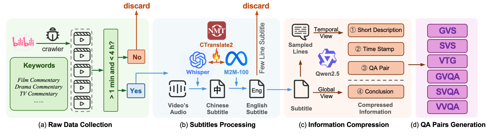
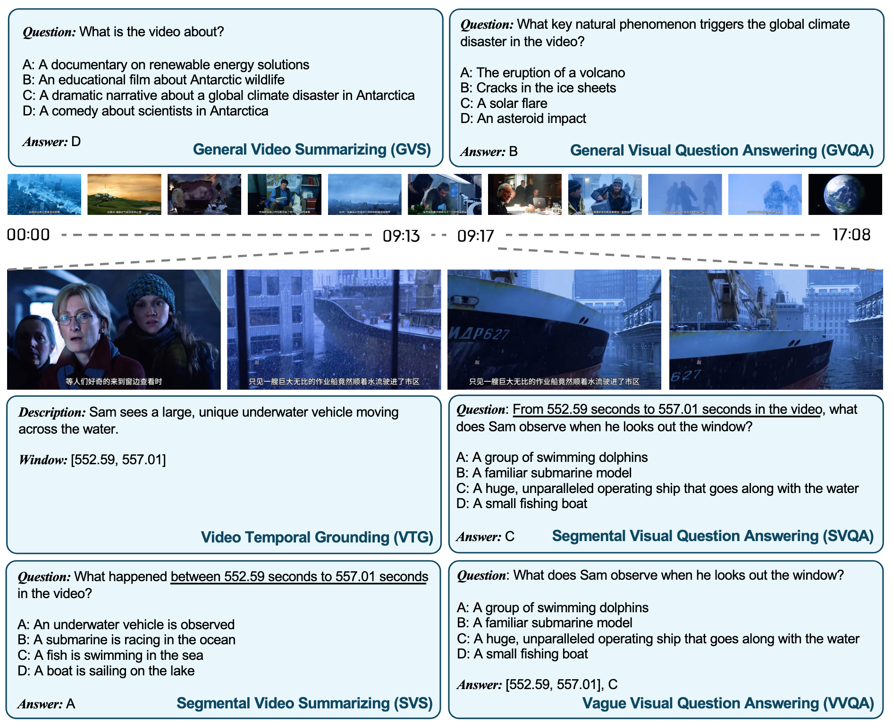

# 📸 *LoMo-Pipe*: First Open-Sourced Automatic Video QA Annotation Pipeline
> Larger dataset should **not** be the work only for large group with more resources.



**LoMo-Pipe** is the first open-sourced LLM-assist video understanding benchmark construction pipeline. Here are four stages for data construction:

* Stage 1: **Raw Data Collection** - a downloader to download videos from the Internet as raw data;
* Stage 2: **Subtitles Processing** - a program to convert the audio into the text description with time stamps and a translator from Chinese to English;
* Stage 3: **Information Compression** - a program to compress the substitles into a conlusion and extract effective informations;
* Stage 4: **QA Pairs Generation** - we provide some manuscripts to generate different kinds of QA pairs.

# 🔧 Preparation

## Hardware Requirements

LoMo-Pipe is a automatic data annotation pipeline with **Lo**wer cost and **Mo**re efficiency. We carefully select the models without high computational resources requirements and sucussfully run the whole project with on **2 RTX 4090 GPUs**, which is practical for most AI researchers (Sorry for if not 😢).

## Software Requirements
To run this project, you need do the preparation for the following steps:

## Stage 1

You need to put the SESSDATA into the file `bilibili_downloader.py`:

```python
SESSDATA = "Put Your SESSDATA of Bilibili here"
```

You can get your SESSDATA of Bilibili account from this [tutorial](https://www.bilibili.com/opus/824969342470848537) (only for Chinese). If you want to get the video from Youtube, you can go through [youtube-dl](https://github.com/ytdl-org/youtube-dl) project.

⚠️ **Attention**: This code is only for research use. You can not utilize this code for commercial use!

## Stage 2

For `audio2text.py`, please follow the instruction in [faster-whisper](https://github.com/SYSTRAN/faster-whisper) to use the faster version OpenAI whisper, or run the following line:

```bash
pip install faster-whisper
```
 Also, you can use original OpenAI [whisper](https://github.com/openai/whisper), or run the following line:

 ```bash
 pip install -U openai-whisper
 ```

 For `chinese2english_translator.py`, please following the instruction in [hf_hub_ctranslate2](https://github.com/michaelfeil/hf-hub-ctranslate2), or run the following line:
 ```bash
 pip install hf-hub-ctranslate2
 ```

 ## Stage 3 & 4

 We utilize Qwen to automaticly generate the data, please following the instruction [Qwen2.5-7B-Instruct](https://huggingface.co/Qwen/Qwen2.5-7B-Instruct).

 We load the weight in offline way. You need to download the weights to the folder `weights` by the following line:
 ```bash
huggingface-cli download --resume-download Qwen/Qwen2.5-7B-Instruct --local-dir Qwen2.5-7B-Instruct

# If huggingface cannot use
modelscope download --model Qwen/Qwen2.5-7B-Instruct
 ```

 # 💡 Usage

 The argument for the manuscripts:
 * `bilibili_downloader.py`
    * `--bvid`: bvid number of the video in Bilibili. You can get the bvid of the video from Bilibili following the [instruction](https://www.bilibili.com/opus/657511513950519314) (Only Chinese)
    * `--output`: output folder
    * `--resolution`: the resolution of the video, you can choose from `[1080P, 720P]`

* `audio2text.py`
    * `--video_path`: path to the video need to be convert into text
    * `--sub_path`: path to save the text
    * `--audio_path`: path to save the audio
    * `--log_path`: path to save the log file

* other manuscripts
    * `--input_folder`: path to the folder containing Chinese subtitles
    * `--output_folder`: path to the folder to save English subtitles


# 📹 Example Benchmark - LoMo

We utilize this pipeline to form the LoMo Video benchmark with 14,000+ videos. You can find the LoMo benchmark in [HuggingFace](https://huggingface.co/datasets/ryohu053/LoMo_Video_Benchmark).


# Acknowledgement

If you have any question, please contect by E-mail: `huchengyang@sjtu.edu.cn`

We thank the following open-source projects:

* [youtube-dl](https://github.com/ytdl-org/youtube-dl)
* [faster-whisper](https://github.com/SYSTRAN/faster-whisper)
* [whisper](https://github.com/openai/whisper)
* [CTranslate](https://github.com/OpenNMT/CTranslate2)
* [Qwen](https://github.com/QwenLM/Qwen)


